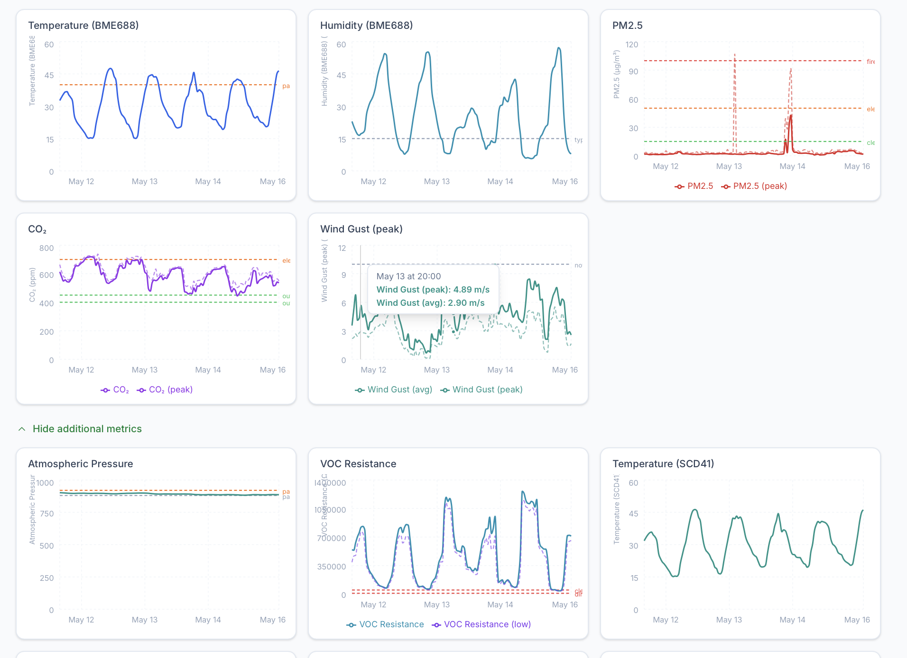
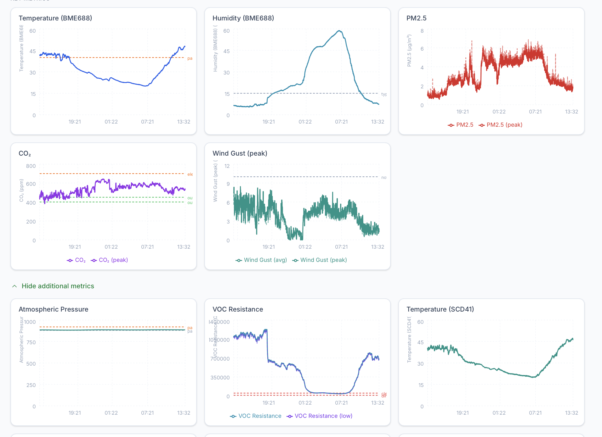

# May 15th Smoke Haze Instrument Readings Notes

> Based on a 24 hour time series view of the readings graphs from the agrishield.landmanager.io dashboard
 
This 24-hour view looks like a **broad, elevated background smoke / haze condition**, not a sharp nearby plume event like the May 14 spike.

What I see:

### PM2.5 shows sustained elevation

The PM2.5 curve starts near roughly **1 µg/m³**, then rises into the **2–3 µg/m³** range, then spends a long overnight/morning period mostly around **4–6+ µg/m³** before tapering back down later.

That is different from the May 14 event. May 14 looked like a sharper pulse. This looks more like:

```text
Regional smoke/haze loading
not a direct plume hit
```

The important visual pattern is that PM2.5 stays elevated for hours rather than producing one clean spike. That fits your description: fires in the area, not directly upwind, but enough dispersed smoke in the air to smell.

### VOC resistance drops dramatically, but humidity is a major confounder

The VOC Resistance chart shows a very large drop starting around the evening transition, then it stays near the bottom for many hours before recovering later in the day.

That *could* be consistent with smoke-related gas exposure, but the humidity chart is the big caution. Humidity rises strongly from low single digits up to around **55–60%**, and the VOC resistance drops during that same broad period.

So the BME688 is probably seeing a combined effect:

```text
higher humidity
+ possible smoke/VOC combustion gases
+ lower nighttime temperature
= large resistance suppression
```

I would not attribute this whole VOC drop to smoke. The shape is too closely aligned with the overnight humidity/temperature cycle.

### The stronger smoke evidence is PM2.5, not VOC resistance

For this 24-hour period, I’d rank the signals this way:

```text
PM2.5 sustained elevation: strong evidence of regional smoke/haze
VOC resistance drop: possible supporting signal, but heavily humidity-confounded
CO₂: not a clear smoke discriminator here
Wind gust: useful context, but direction is needed
Humidity/temp: very important explanatory variables
```

### This looks like a different event class than May 14

I would separate your event types into at least two classes:

```text
Class 1: Direct plume / nearby fire influence
- sharp PM2.5 spike
- possible simultaneous VOC resistance drop
- often wind-direction dependent
- short duration or pulse-like

Class 2: Regional smoke / dispersed haze
- PM2.5 elevated for many hours
- lower peak intensity
- smoke odor possible
- VOC resistance may be depressed, but humidity and nighttime conditions dominate
```

This screenshot looks like **Class 2: regional smoke/haze**.

### What I would do next in your detector logic

For this kind of pattern, I would create a “background smoke burden” metric rather than just a peak-event metric.

For example:

```python
pm25_baseline = rolling_median_pm25_24h_or_48h
pm25_ratio = pm25 / pm25_baseline

sustained_pm_event = (
    pm25_ratio > 2.0
    and pm25 > 3.0
    for at least 60 minutes
)
```

Or more simply:

```python
regional_smoke = (
    pm25_rolling_60min_avg > normal_pm25_baseline + threshold
)
```

The May 14 event would be detected by **rate-of-change / spike logic**.

This current 24-hour event would be detected by **sustained elevation / area-under-the-curve logic**.

### My conclusion

Your current graph does appear to show an **elevated PM2.5 pattern consistent with regional smoke in the air**. The BME688 VOC resistance drop is interesting, but in this 24-hour view I would treat it cautiously because it tracks the humidity rise and temperature fall very strongly.

For this event, I’d say:

```text
Smoke/haze indication: yes
Primary evidence: sustained PM2.5 elevation
VOC resistance correlation: possible, but not clean
Best classification: regional smoke burden / dispersed haze event
```
